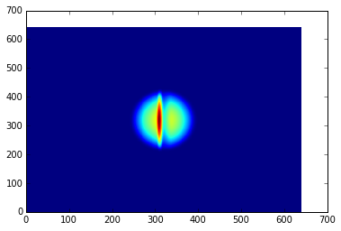

********
Examples
********

Expectation values of the Hamiltonian and kinetic operators
-----------------------------------------------------------
The following code block gives a simple example of initializing a state and calculating the expectation values of the Hamiltonian and kinetic operators and the norm of the state after the evolution.

.. code-block:: python
		
    from __future__ import print_function
    import numpy as np
    from trottersuzuki import *

    # create a 2D lattice with 100x100 points and 20x20 area
    grid = Lattice(256, 15, 15)

    # define an symmetric harmonic potential with unit frequecy
    potential = HarmonicPotential(grid, 1)

    # define the Hamiltonian:
    particle_mass = 1.
    hamiltonian = Hamiltonian(grid, potential, particle_mass)

    # define gaussian wave function state: we choose the ground state of the Hamiltonian
    frequency = 1
    state = GaussianState(grid, frequency)

    # define the solver
    time_of_single_iteration = 1.e-4
    solver = Solver(grid, state, hamiltonian, time_of_single_iteration)

    # get some expected values from the initial state
    print "norm: ", state.get_squared_norm()
    print "Total energy: ", state.get_total_energy()
    print "Kinetic energy: ", state.get_kinetic_energy()

    # evolve the state of 1000 iterations
    number_of_iterations = 1000
    solver.evolve(number_of_iterations)

    # get some expected values from the evolved state
    print "norm: ", state.get_squared_norm()
    print "Total energy: ", state.get_total_energy()
    print "Kinetic energy: ", state.get_kinetic_energy()

Imaginary time evolution to approximate the ground-state energy
---------------------------------------------------------------
.. code-block:: python

    from __future__ import print_function
    import numpy as np
    from trottersuzuki import *

    # create a 2D lattice with 100x100 points and 20x20 area
    grid = Lattice(256, 15, 15)

    # define an symmetric harmonic potential with unit frequecy
    potential = HarmonicPotential(grid, 1)

    # define the Hamiltonian:
    particle_mass = 1.
    hamiltonian = Hamiltonian(grid, potential, particle_mass)

    # define gaussian wave function state: we choose the ground state of the Hamiltonian
    frequency = 3
    state = GaussianState(grid, frequency)

    # define the solver
    time_of_single_iteration = 1.e-4
    solver = Solver(grid, state, hamiltonian, time_of_single_iteration)

    # get some expected values from the initial state
    print "norm: ", state.get_squared_norm()
    print "Total energy: ", state.get_total_energy()
    print "Kinetic energy: ", state.get_kinetic_energy()

    # evolve the state of 40000 iterations
    number_of_iterations = 40000
    imaginary_evolution = true
    solver.evolve(number_of_iterations, imaginary_evolution)

    # get some expected values from the evolved state
    print "norm: ", state.get_squared_norm()
    print "Total energy: ", state.get_total_energy()
    print "Kinetic energy: ", state.get_kinetic_energy()

Dark Soliton Generation in Bose-Einstein Condensate using Phase Imprinting
--------------------------------------------------------------------------
This example simulates the evolution of a dark soliton in a Bose-Einstein Condensate. For a more detailed description, refer to `this notebook <https://github.com/Lucacalderaro/Master-Thesis/blob/master/Soliton%20generation%20on%20Bose-Einstein%20Condensate.ipynb>`_.

.. code-block:: python

    from __future__ import print_function
    import numpy as np
    import trottersuzuki as ts
    from matplotlib import pyplot as plt

    def get_external_potential(dim):
        """Helper function to define external potential.
        """
        def ext_pot(_x, _y):
            x = (_x - dim*0.5) * delta_x
            y = (_y - dim*0.5) * delta_y
            w_x = 1
            w_y = 1 / np.sqrt(2)
            return 0.5 * (w_x*w_x * x*x + w_y*w_y * y*y)

        potential = np.zeros((dim, dim))
        for y in range(0, dim):
            for x in range(0, dim):
                potential[y, x] = ext_pot(x, y)
        return potential

    # lattice parameters
    dim = 640			# number of grid points at the edge
    length = 50.			# physics length of the lattice
    delta_x = length / dim
    delta_y = length / dim

    # Hamiltonian parameter
    particle_mass = 1
    scattering_lenght_2D = 5.662739242e-5
    num_particles = 1700000
    coupling_const = 4. * np.pi * scattering_lenght_2D * num_particles

    external_potential = get_external_potential(dim)

    ####################################
    # ground state approximation
    ####################################

    # initial state
    p_real = np.ones((dim, dim))
    p_imag = np.zeros((dim, dim))
    for y in range(dim):
        for x in range(dim):
            p_real[y, x] = 1./length

    Norm2 = ts.calculate_norm2(p_real, p_imag, delta_x, delta_y)
    print(Norm2)

    # evolution variables
    iterations = 18000
    delta_t = 1.e-4

    # launch evolution
    ts.evolve(p_real, p_imag, particle_mass, external_potential, delta_x, delta_y,
              delta_t, iterations, coupling_const=coupling_const, imag_time=True)

    Norm2 = ts.calculate_norm2(p_real, p_imag, delta_x, delta_y)
    print(Norm2)

    heatmap = plt.pcolor(p_real)
    plt.show()

    ####################################
    # phase imprinting
    ####################################

    a = 1.98128
    theta = 1.5 * np.pi

    for y in range(dim):
        for x in range(dim):
            tmp_real = np.cos(theta * 0.5 * (1.+np.tanh(-a * (x-dim/2.)*delta_x)))
            tmp_imag = np.sin(theta * 0.5 * (1.+np.tanh(-a * (x-dim/2.)*delta_x)))
            tmp = p_real[y, x]
            p_real[y, x] = tmp_real * tmp - tmp_imag * p_imag[y, x]
            p_imag[y, x] = tmp_real * p_imag[y, x] + tmp_imag * tmp

    np.savetxt('InistatePhaseImprinted_real.dat', p_real, delimiter=' ')
    np.savetxt('InistatePhaseImprinted_imag.dat', p_imag, delimiter=' ')

    heatmap = plt.pcolor(p_real)
    plt.show()

    ####################################
    # real time evolution
    ####################################

    # evolution variables
    iterations = 2000
    delta_t = 5.e-5
    kernel_type = 0

    # launch evolution
    ts.evolve(p_real, p_imag, particle_mass, external_potential,
              delta_x, delta_y, delta_t, iterations, coupling_const=coupling_const)

    # calculate particle density
    norm_2 = np.ones((dim, dim))
    for y in range(dim):
        for x in range(dim):
            norm_2[y, x] = (p_real[y, x] * p_real[y, x] +
                            p_imag[y, x] * p_imag[y, x]) * num_particles

    heatmap = plt.pcolor(norm_2)
    plt.show()

The results are the following plots:

.. image:: figures/bec1.png

.. image:: figures/bec2.png

