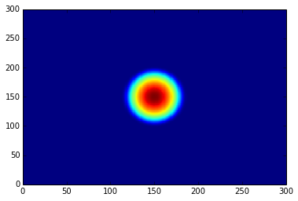
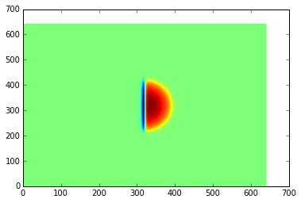

********
Examples
********

Expectation values of the Hamiltonian and kinetic operators
-----------------------------------------------------------
The following code block gives a simple example of initializing a state and calculating the expectation values of the Hamiltonian and kinetic operators and the norm of the state after the evolution.

.. code-block:: python

    import numpy as np
    from trottersuzuki import *

    grid = Lattice(256, 15)  # create a 2D lattice
    
    potential = HarmonicPotential(grid, 1, 1)  # define an symmetric harmonic potential with unit frequecy
    particle_mass = 1.
    hamiltonian = Hamiltonian(grid, potential, particle_mass)      # define the Hamiltonian:

    frequency = 1
    state = GaussianState(grid, frequency)  # define gaussian wave function state: we choose the ground state of the Hamiltonian

    time_of_single_iteration = 1.e-4
    solver = Solver(grid, state, hamiltonian, time_of_single_iteration)  # define the solver

    # get some expected values from the initial state
    print("norm: ", solver.get_squared_norm())
    print("Total energy: ", solver.get_total_energy())
    print("Kinetic energy: ", solver.get_kinetic_energy())

    number_of_iterations = 1000
    solver.evolve(number_of_iterations)  # evolve the state of 1000 iterations

    # get some expected values from the evolved state
    print("norm: ", solver.get_squared_norm())
    print("Total energy: ", solver.get_total_energy())
    print("Kinetic energy: ", solver.get_kinetic_energy())

Imaginary time evolution to approximate the ground-state energy
---------------------------------------------------------------
.. code-block:: python

    import numpy as np
    from trottersuzuki import *

    grid = Lattice(256, 15)  # create a 2D lattice

    potential = HarmonicPotential(grid, 1, 1)  # define an symmetric harmonic potential with unit frequecy
    particle_mass = 1.
    hamiltonian = Hamiltonian(grid, potential, particle_mass)  # define the Hamiltonian:

    frequency = 3
    state = GaussianState(grid, frequency)  # define gaussian wave function state: we choose the ground state of the Hamiltonian

    time_of_single_iteration = 1.e-4
    solver = Solver(grid, state, hamiltonian, time_of_single_iteration)  # define the solver

    # get some expected values from the initial state
    print("norm: ", solver.get_squared_norm())
    print("Total energy: ", solver.get_total_energy())
    print("Kinetic energy: ", solver.get_kinetic_energy())

    number_of_iterations = 40000
    imaginary_evolution = true
    solver.evolve(number_of_iterations, imaginary_evolution)      # evolve the state of 40000 iterations

    # get some expected values from the evolved state
    print("norm: ", solver.get_squared_norm())
    print("Total energy: ", solver.get_total_energy())
    print("Kinetic energy: ", solver.get_kinetic_energy())

Imprinting of a vortex in a Bose-Einstein Condensate
----------------------------------------------------

.. code-block:: python

    import numpy as np
    import trottersuzuki as ts

    grid = ts.Lattice(256, 15)  # create a 2D lattice
    
    potential = HarmonicPotential(grid, 1, 1)  # define an symmetric harmonic potential with unit frequecy
    particle_mass = 1.
    coupling_intra_particle_interaction = 100.
    hamiltonian = Hamiltonian(grid, potential, particle_mass, coupling_intra_particle_interaction)  # define the Hamiltonian:
    
    frequency = 1
    state = GaussianState(grid, frequency)  # define gaussian wave function state: we choose the ground state of the Hamiltonian
    def vortex(x, y):  # vortex to be imprinted
        z = x + 1j*y
        angle = np.angle(z)
        return np.exp(1j * angle)
    
    state.imprint(vortex)  # imprint the vortex on the condensate
    
    time_of_single_iteration = 1.e-4
    solver = Solver(grid, state, hamiltonian, time_of_single_iteration)  # define the solver

Dark Soliton Generation in Bose-Einstein Condensate using Phase Imprinting
--------------------------------------------------------------------------
This example simulates the evolution of a dark soliton in a Bose-Einstein Condensate. For a more detailed description, refer to `this notebook <https://github.com/Lucacalderaro/Master-Thesis/blob/master/Soliton%20generation%20on%20Bose-Einstein%20Condensate.ipynb>`_.

.. code-block:: python

    from __future__ import print_function
    import numpy as np
    import trottersuzuki as ts
    from matplotlib import pyplot as plt
    
    grid = ts.Lattice(300, 50.)  # # create a 2D lattice
    
    potential = ts.HarmonicPotential(grid, 1., 1./np.sqrt(2.))  # create an harmonic potential
    coupling = 1.2097e3
    hamiltonian = ts.Hamiltonian(grid, potential, 1., coupling)  # create the Hamiltonian
    
    state = ts.GaussianState(grid, 0.05)  # create the initial state
    solver = ts.Solver(grid, state, hamiltonian, 1.e-4)  # initialize the solver
    solver.evolve(10000, True)  # evolve the state towards the ground state
    
    density = state.get_particle_density()
    plt.pcolor(density)  # plot the particle denisity
    plt.show()
    
    def dark_soliton(x,y):  # define phase imprinting that will create the dark soliton
        a = 1.98128
        theta = 1.5*np.pi
        return np.exp(1j* (theta * 0.5 * (1. + np.tanh(-a * x))))
    
    state.imprint(dark_soliton)  # phase imprinting
    solver.evolve(1000)  # perform a real time evolution
    
    density = state.get_particle_density()
    plt.pcolor(density)  # plot the particle denisity
    plt.show()

The results are the following plots:

